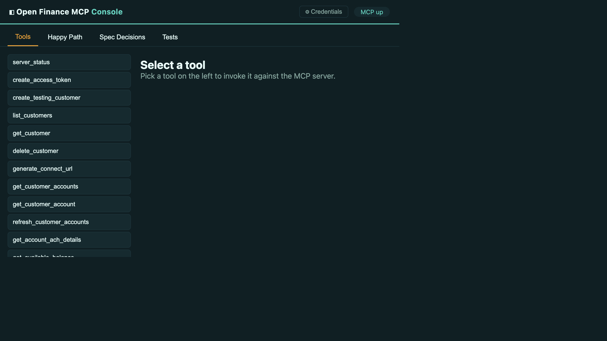

# Open Finance US MCP

A standalone [Model Context Protocol](https://modelcontextprotocol.io) server
that wraps the **Mastercard Open Finance US (Finicity)** hosted APIs
(`https://api.finicity.com`). It is a separate codebase from Vima and vendors
its own Finicity client — no dependency on Vima's `apis/`, `execute()` wrapper,
or simulator.



## Layout

```
openfinance-mcp/
  src/openfinance_mcp/
    finicity_client.py   # vendored Finicity client (only depends on requests)
    server.py            # FastMCP server + tools
    models.py            # ToolResult envelope
    spec_defaults.py     # resolved spec decisions + open questions
    config/settings.py   # credential loader (env / dotenv / sibling vima config/.env)
    __main__.py          # stdio + streamable-http entry point
  tests/                 # unit, protocol (offline) + sandbox (live) suites
  console/               # separate, independently deployable demo UI
  run.sh / run.bat       # one-shot start scripts for the MCP server
  console/run.sh / .bat  # one-shot start scripts for the Test Console
```

---

## 1 — Get Credentials

Credentials are issued through the **Mastercard Developers** portal.

1. [Sign up or log in](https://developer.mastercard.com/account/sign-up) at `developer.mastercard.com`.
2. Click **Create New Project**, enter a project name, and select **Open Finance** from the *Select your API service* dropdown.
3. Select the commercial country for your end users, then click **Proceed**.
4. Enter a description, click **Create Project**.
5. In the left-hand **Credentials** panel click **Sandbox** — your three credential values are shown:

   | Variable | Portal label |
   |---|---|
   | `OPEN_FINANCE_PARTNER_ID` | Partner ID |
   | `OPEN_FINANCE_PARTNER_SECRET` | Secret |
   | `OPEN_FINANCE_APP_KEY` | App Key |

Full quick-start guide: <https://developer.mastercard.com/open-banking-us/documentation/quick-start-guide/>

> **API base URL** defaults to `https://api.finicity.com`. Override with
> `OPEN_FINANCE_API_BASE_URL` if needed.

---

## 2 — Configure Credentials

### Option A — Test Console UI (recommended)

Start the console (see below), then click the **⚙ Credentials** button in the
top-right corner. Paste your values and click **Save to .env**. The file is
written to `.env` in the repo root.

### Option B — Edit `.env` directly

Create `.env` in the repo root:

```dotenv
OPEN_FINANCE_PARTNER_ID=your_partner_id
OPEN_FINANCE_PARTNER_SECRET=your_partner_secret
OPEN_FINANCE_APP_KEY=your_app_key
OPEN_FINANCE_API_BASE_URL=https://api.finicity.com
```

### Resolution order

1. Process environment variables.
2. `OPENFINANCE_MCP_ENV_FILE` (explicit dotenv path).
3. `.env` in this repo root.
4. Sibling `../vima/config/.env` (auto-discovered).

---

## 3 — Start the MCP Server

The run scripts create a `.venv`, install dependencies, kill any previous
instance, and start the server — no manual `pip install` required.

**macOS / Linux**
```bash
./run.sh
# Defaults: transport=http, host=0.0.0.0, port=9030
```

**Windows**
```bat
run.bat
```

Override defaults via environment variables:
```bash
PORT=9030 TRANSPORT=http ./run.sh
```

**Manual (without the script)**
```bash
python -m venv .venv && source .venv/bin/activate
pip install -e ".[test,console]"
python -m openfinance_mcp --transport http --port 9030
```

---

## 4 — Start the Test Console

**macOS / Linux**
```bash
./console/run.sh
# open http://localhost:8080
```

**Windows**
```bat
console\run.bat
```

Override defaults:
```bash
PORT=8080 MCP_URL=http://localhost:9030/mcp ./console/run.sh
```

**Manual**
```bash
cd console
pip install -r requirements.txt
MCP_URL=http://localhost:9030/mcp uvicorn app:app --port 8080
```

Or start both MCP server and console together with Docker:
```bash
docker compose up --build
```

---

## 5 — Run Tests

```bash
# Offline unit + protocol tests (no credentials needed)
pytest -m "not sandbox"

# Live sandbox tests (requires valid credentials in .env)
pytest -m sandbox
```

---

## Project layout (detail)

```
openfinance-mcp/
  src/openfinance_mcp/
    finicity_client.py
    server.py
    models.py
    spec_defaults.py
    config/settings.py
    __main__.py
  tests/
  console/
    app.py              # FastAPI bridge (MCP client → browser)
    static/             # index.html, console.js, console.css
    run.sh / run.bat
  docs/
    console-screenshot.png
  run.sh / run.bat
  docker-compose.yml
  pyproject.toml
```

---

## Resolved spec decisions

| Question | Answer | Status |
|---|---|---|
| PSI path/body | `POST /payments/customers/{id}/accounts/{aid}/payment-success-indicators`, `{"transaction":{"settleByDate","amount"}}` | confirmed |
| VOAI slug | `voaHistory` | confirmed |
| TxPUSH body | `{"callbackUrl": <url>}` | confirmed |

The console's **Spec Decisions** tab renders these live from the running server.
